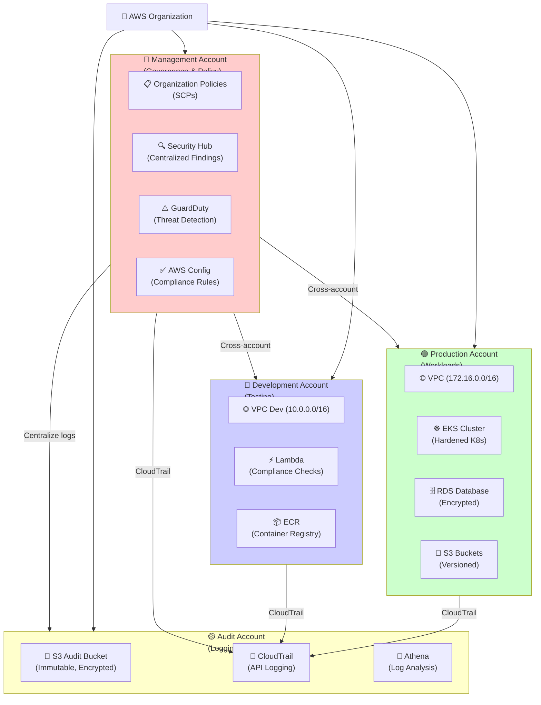
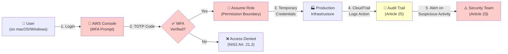
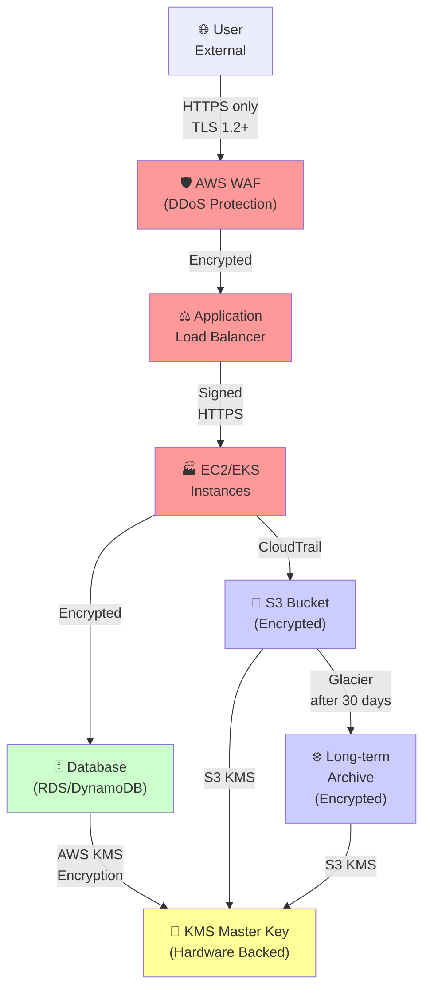
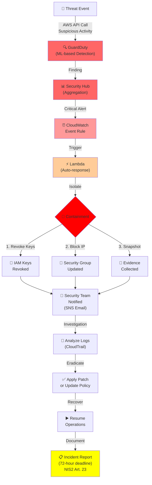
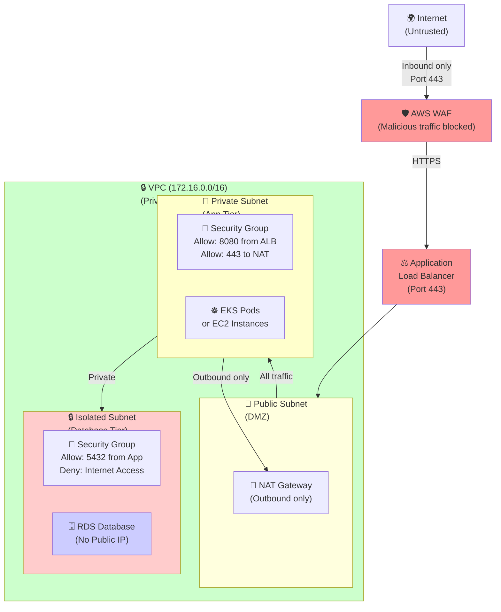
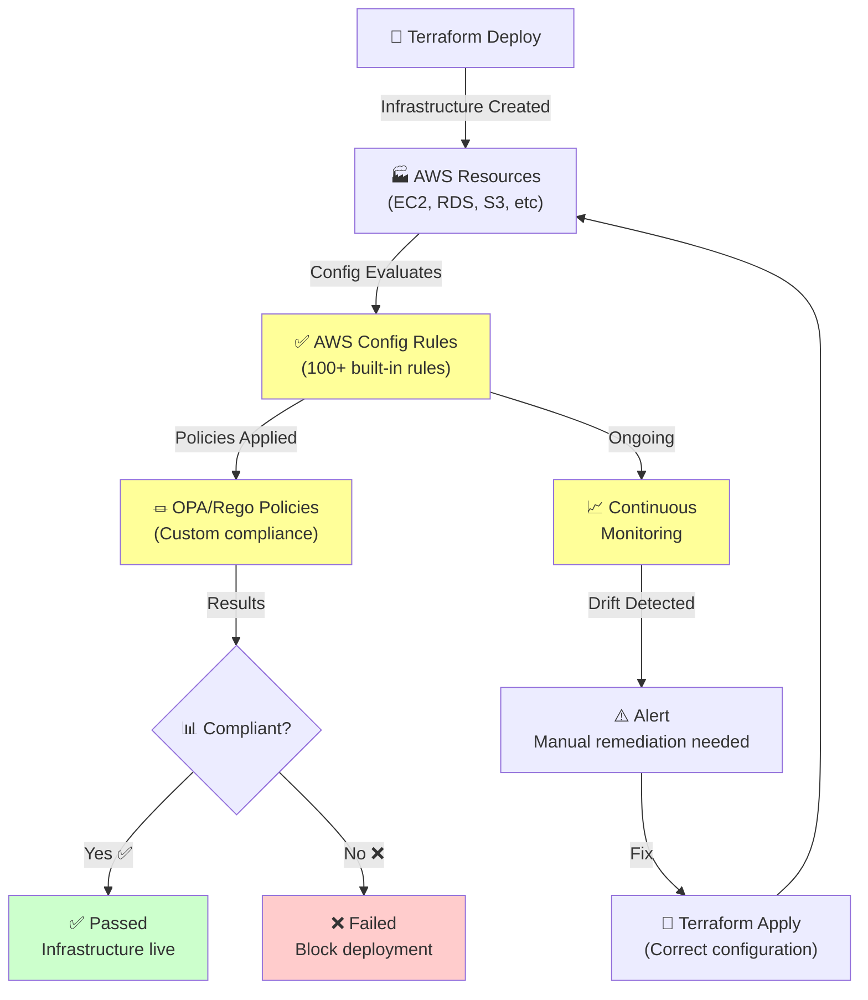
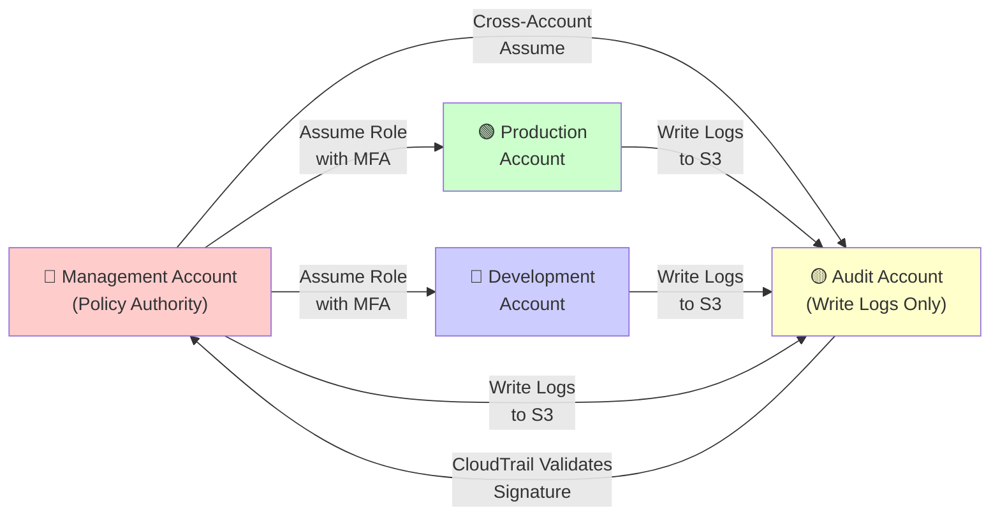
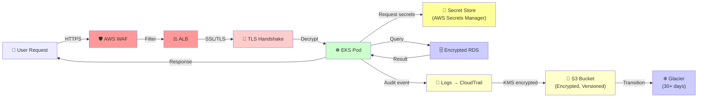

# AWS Multi-Account Security Architecture

> Complete infrastructure topology for **NIS2, DORA, and ISO 27001 compliance** across AWS accounts.

---

## 📊 Multi-Account Organization Structure

This baseline organizes your AWS environment into **4 specialized accounts**:

**Key Design:**
- **Isolation:** Each account is a separate blast radius
- **Centralization:** Audit account collects all logs
- **Governance:** Management account enforces policies
- **Efficiency:** Dev/Prod accounts run workloads independently

---

## 🔐 NIS2 Article 21: Access Control & Authentication

Multi-factor authentication and privilege management flow:

**NIS2 Article 21 Controls:**
- ✅ **21(1):** Multi-factor authentication enforced
- ✅ **21(2):** Role-based access control (RBAC)
- ✅ **21(3):** Privilege escalation restricted
- ✅ **21(4):** Session duration limited (max 1 hour)
- ✅ **21(5):** Access review logs (CloudTrail)

**Implementation Files:**
- `modules/iam/permission-boundary/` - Policy enforcement
- `compliance/nis2/article-21-access-control.tf` - Examples

---

## 🔒 Data Protection: Encryption at Rest & In Transit (Article 25)

Data flow showing encryption at every layer:

**NIS2 Article 25 Controls:**
- ✅ **In Transit:** TLS 1.2+ for all network traffic
- ✅ **At Rest:** AWS KMS encryption for data storage
- ✅ **Key Management:** Hardware-backed master key
- ✅ **Rotation:** Automatic annual key rotation
- ✅ **Access Logging:** All KMS operations logged

**Implementation Files:**
- `modules/logging/main.tf` - KMS key setup
- `envs/prod/main.tf` - S3 bucket encryption
- `compliance/nis2/article-25-audit-logging.tf` - Examples

---

## 🚨 Incident Detection & Response (Article 23)

Automated threat detection and containment workflow:

**NIS2 Article 23 Controls:**
- ✅ **Detection:** GuardDuty + CloudWatch + Config
- ✅ **Analysis:** Automated Lambda functions
- ✅ **Containment:** Immediate access revocation
- ✅ **Recovery:** Infrastructure rollback capability
- ✅ **Reporting:** 72-hour incident notification

**Implementation Files:**
- `compliance/nis2/article-23-incident-response.tf` - Detection setup
- `policies-as-code/opa/` - Automated response policies

---

## 🌐 Network Segmentation (Article 32)

Defense-in-depth network architecture:

**NIS2 Article 32 Controls:**
- ✅ **Perimeter:** AWS WAF blocks malicious traffic
- ✅ **DMZ:** Public subnet isolated with NAT Gateway
- ✅ **App Tier:** Private subnet with restricted ingress
- ✅ **Database:** Isolated subnet with no internet access
- ✅ **Monitoring:** VPC Flow Logs on all subnets

**Implementation Files:**
- `envs/prod/main.tf` - VPC setup
- `examples/mittelstand-sme/main.tf` - Network configuration

---

## 📋 Compliance Continuous Monitoring (Article 28)

Automated compliance checking across infrastructure:

**NIS2 Article 28 Controls:**
- ✅ **As-Code:** Infrastructure defined in Git
- ✅ **Policy Testing:** OPA policies validate before deploy
- ✅ **Continuous Monitoring:** AWS Config watches for drift
- ✅ **Automated Remediation:** Lambda fixes violations
- ✅ **Evidence Trail:** Version-controlled compliance artifacts

**Implementation Files:**
- `policies-as-code/opa/` - Policy definitions
- `modules/config/` - AWS Config setup

---

## 🗂️ Multi-Account Cross-Account Access

How different accounts interact securely:

**Cross-Account Best Practices:**
- ✅ **SCP Policies:** Organization policies enforced at root level
- ✅ **Role Assumption:** Always require MFA for cross-account access
- ✅ **Audit Account:** Separate account for immutable logs
- ✅ **Least Privilege:** Minimal permissions per role
- ✅ **CloudTrail Validation:** S3 Object Lock prevents tampering

---

## 🔄 Data Flow: End-to-End

Complete lifecycle of a user request through the secured infrastructure:

---

## 🎯 Compliance Framework Mapping

How each component maps to compliance requirements:

| Component | NIS2 Article | DORA Article | ISO 27001 | Purpose |
|-----------|--------------|--------------|-----------|---------|
| **Multi-Account** | 28, 32 | 13 | A.6.1 | Segregation of duties |
| **IAM + MFA** | 21 | 14 | A.9 | Access control |
| **CloudTrail** | 25 | 10 | A.12.4 | Audit logging |
| **AWS Config** | 28 | - | A.12.6 | Configuration management |
| **GuardDuty** | 23 | 6 | A.12.2 | Threat detection |
| **KMS Encryption** | 25 | 11 | A.10.1 | Cryptography |
| **VPC Isolation** | 32 | 12 | A.13.1 | Network controls |
| **Backup/DR** | 17 | 17 | A.12.3 | Business continuity |

---

## 📚 Architecture Decisions

### Why Multi-Account?

- **Blast Radius:** Compromise in Dev doesn't affect Prod
- **Access Control:** Different IAM policies per account
- **Billing:** Track costs by environment
- **Compliance:** Audit account separate from operations
- **Scaling:** Add accounts for new business units

### Why Terraform?

- **Infrastructure as Code:** Version control for infrastructure
- **Repeatability:** Deploy identical baselines
- **Automation:** GitOps pipelines
- **Compliance:** Code review before deployment
- **Documentation:** Comments explain design decisions

### Why OPA/Rego?

- **Policy as Code:** Compliance rules in code
- **Pre-deployment:** Catch violations before AWS
- **Automation:** No manual approval gates
- **Audit Trail:** Policy changes in Git
- **Extensibility:** Add custom rules easily

---

## 🔧 Customization Points

| Area | Files | Customization |
|------|-------|---------------|
| **Network** | `envs/prod/main.tf` | Change VPC CIDR, add subnets |
| **IAM** | `modules/iam/` | Add roles, adjust permissions |
| **Backup** | `examples/*/terraform.tfvars` | Change retention, RTO/RPO |
| **Logging** | `modules/logging/` | Change S3 prefix, retention |
| **Compliance** | `policies-as-code/opa/` | Add custom policies |
| **Kubernetes** | `kubernetes/k3s-hardened/` | Adjust node count, instance type |

---

## 📖 Related Documentation

- **[README.md](./README.md)** — Feature overview
- **[GETTING_STARTED.md](./GETTING_STARTED.md)** — 5-minute setup
- **[compliance/nis2/README.md](./compliance/nis2/README.md)** — NIS2 details
- **[docs/disaster-recovery.md](./docs/disaster-recovery.md)** — Backup strategy
- **[kubernetes/k3s-hardened/README.md](./kubernetes/k3s-hardened/README.md)** — K8s hardening

---

**Next:** [GETTING_STARTED.md](./GETTING_STARTED.md) — Deploy in 5 minutes 🚀
